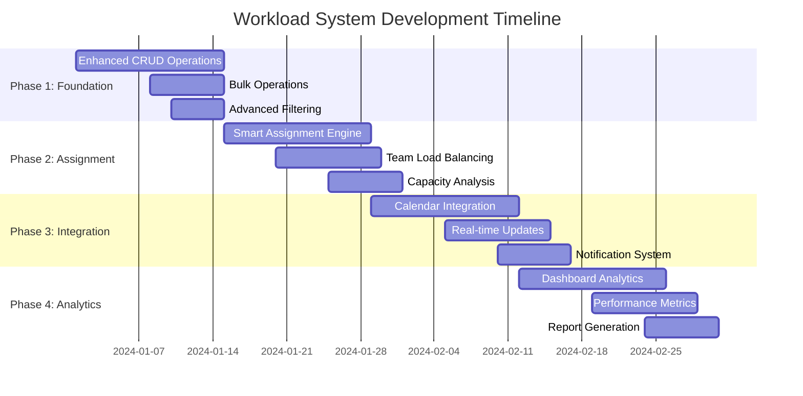

# 🗺️ Workload System Development Roadmap

## 📋 8-Week Progressive Development Plan

### 🎯 Development Phases Overview



---

## 📅 Week-by-Week Development Plan

### **Week 1-2: Foundation Enhancement Phase**

#### **Week 1 Objectives**
- ✅ Enhanced CRUD operations with validation
- ✅ Database schema extensions
- ✅ Basic file upload system
- ✅ Improved API endpoints

**Day 1-2: Database Enhancement**
```sql
-- Migration Script: 001_enhance_workload_schema.sql
ALTER TABLE workload ADD COLUMN IF NOT EXISTS dependencies TEXT;
ALTER TABLE workload ADD COLUMN IF NOT EXISTS tags TEXT;
ALTER TABLE workload ADD COLUMN IF NOT EXISTS complexity_score INTEGER DEFAULT 1;
ALTER TABLE workload ADD COLUMN IF NOT EXISTS progress_percentage INTEGER DEFAULT 0;

-- Create supporting tables
CREATE TABLE workload_assignments (
    id UUID PRIMARY KEY DEFAULT uuid_generate_v4(),
    workload_id UUID REFERENCES workload(id) ON DELETE CASCADE,
    assigned_to UUID REFERENCES users(id) ON DELETE CASCADE,
    role TEXT DEFAULT 'assignee',
    assigned_at TIMESTAMP WITH TIME ZONE DEFAULT NOW()
);
```

**Day 3-4: Enhanced API Development**
```typescript
// api/workload/enhanced/route.ts
export async function POST(req: NextRequest) {
  const data = await req.json();
  
  // Enhanced validation
  const validatedData = await workloadSchema.parseAsync(data);
  
  // Create with file attachments
  const workload = await workloadService.createWithAttachments(validatedData);
  
  return NextResponse.json(workload);
}

export async function PUT(req: NextRequest) {
  const { searchParams } = new URL(req.url);
  const id = searchParams.get('id');
  const data = await req.json();
  
  const updatedWorkload = await workloadService.update(id, data);
  
  return NextResponse.json(updatedWorkload);
}
```

**Day 5-7: Enhanced Form Components**
```typescript
// Deliverable: Enhanced WorkloadForm with:
// - File upload support
// - Advanced validation
// - Tag management
// - Dependency selection
// - Progress tracking
```

#### **Week 2 Objectives**
- ✅ Bulk operations implementation
- ✅ Advanced filtering and search
- ✅ Time tracking foundation
- ✅ Basic analytics setup

**Day 8-9: Bulk Operations API**
```typescript
// api/workload/bulk/route.ts
export async function POST(req: NextRequest) {
  const { operation, workloadIds, data } = await req.json();
  
  switch (operation) {
    case 'assign':
      return await bulkAssign(workloadIds, data.assigneeId);
    case 'update':
      return await bulkUpdate(workloadIds, data.updates);
    case 'delete':
      return await bulkDelete(workloadIds);
  }
}
```

**Day 10-12: Advanced Filtering System**
```typescript
// components/workload/AdvancedFilters.tsx
interface FilterState {
  status: WorkloadStatus[];
  priority: Priority[];
  assignedTo: string[];
  dateRange: DateRange;
  search: string;
  tags: string[];
}

export function AdvancedFilters({ onFiltersChange }: AdvancedFiltersProps) {
  // Implementation with real-time filtering
  // Debounced search
  // Multi-select filters
  // Date range pickers
}
```

**Week 1-2 Deliverables:**
- ✅ Enhanced workload CRUD operations
- ✅ File upload and attachment system
- ✅ Bulk operations (assign, update, delete)
- ✅ Advanced filtering interface
- ✅ Time tracking foundation
- ✅ Basic analytics dashboard

### **Week 3-4: Assignment System Phase**

#### **Week 3 Objectives**
- ✅ Smart assignment recommendation engine
- ✅ User capacity analysis system
- ✅ Assignment conflict detection
- ✅ Team workload visualization

**Day 15-17: Smart Assignment Engine**
```typescript
// services/SmartAssignmentEngine.ts
export class SmartAssignmentEngine {
  async analyzeUserCapacity(userId: string): Promise<CapacityAnalysis> {
    // Current workload calculation
    const currentWorkloads = await this.getCurrentWorkloads(userId);
    
    // Performance metrics
    const performance = await this.getPerformanceMetrics(userId);
    
    // Skill matching
    const skills = await this.getUserSkills(userId);
    
    return {
      currentLoad: this.calculateLoad(currentWorkloads),
      performance,
      skills,
      availability: this.calculateAvailability(currentWorkloads)
    };
  }

  async recommendAssignments(workload: Workload): Promise<AssignmentRecommendation[]> {
    // Skill-based matching
    const skillMatches = await this.findSkillMatches(workload.type);
    
    // Load balancing
    const availableUsers = await this.filterByAvailability(skillMatches);
    
    // Performance scoring
    return await this.scoreAndRankUsers(availableUsers, workload);
  }
}
```

**Day 18-19: Capacity Analysis Dashboard**
```typescript
// components/assignment/CapacityDashboard.tsx
export function CapacityDashboard() {
  const { data: teamCapacity } = useTeamCapacity();
  
  return (
    <div className="grid grid-cols-1 lg:grid-cols-3 gap-6">
      <TeamOverviewChart data={teamCapacity} />
      <IndividualCapacityCards users={teamCapacity.users} />
      <WorkloadDistributionChart distribution={teamCapacity.distribution} />
    </div>
  );
}
```

**Day 20-21: Conflict Detection System**
```typescript
// services/ConflictDetectionService.ts
export class ConflictDetectionService {
  async detectScheduleConflicts(assignment: AssignmentRequest): Promise<Conflict[]> {
    // Time-based conflicts
    const timeConflicts = await this.checkTimeConflicts(assignment);
    
    // Resource conflicts
    const resourceConflicts = await this.checkResourceConflicts(assignment);
    
    // Dependency conflicts
    const dependencyConflicts = await this.checkDependencyConflicts(assignment);
    
    return [...timeConflicts, ...resourceConflicts, ...dependencyConflicts];
  }
}
```

#### **Week 4 Objectives**
- ✅ Team workload balancing algorithms
- ✅ Assignment history tracking
- ✅ Delegation workflow system
- ✅ Assignment notification system

**Day 22-24: Load Balancing System**
```typescript
// services/LoadBalancingService.ts
export class LoadBalancingService {
  async balanceTeamWorkload(teamId: string): Promise<RebalanceResult> {
    const teamMembers = await this.getTeamMembers(teamId);
    const currentWorkloads = await this.getTeamWorkloads(teamId);
    
    // Calculate optimal distribution
    const optimalDistribution = this.calculateOptimalDistribution(
      teamMembers, 
      currentWorkloads
    );
    
    // Generate rebalancing suggestions
    return this.generateRebalancingSuggestions(
      currentWorkloads,
      optimalDistribution
    );
  }
}
```

**Week 3-4 Deliverables:**
- ✅ Smart assignment recommendation system
- ✅ User capacity analysis dashboard
- ✅ Assignment conflict detection
- ✅ Team workload balancing tools
- ✅ Assignment history and audit trail
- ✅ Delegation workflow system

### **Week 5-6: Integration & Real-time Phase**

#### **Week 5 Objectives**
- ✅ Calendar-workload synchronization
- ✅ WebSocket real-time updates
- ✅ Mobile responsiveness
- ✅ Integration testing

**Day 29-31: Calendar Integration**
```typescript
// services/CalendarIntegrationService.ts
export class CalendarIntegrationService {
  async syncWorkloadToCalendar(workload: Workload): Promise<CalendarEvent> {
    // Create calendar event from workload
    const event = await this.createCalendarEvent({
      title: workload.nama,
      description: workload.deskripsi,
      start_date: workload.tglDiterima,
      end_date: workload.tglDeadline,
      creator_id: workload.user_id
    });

    // Link workload to calendar event
    await this.linkWorkloadToEvent(workload.id, event.id);
    
    return event;
  }

  async updateCalendarOnWorkloadChange(workloadId: string, changes: Partial<Workload>) {
    const linkedEvent = await this.getLinkedEvent(workloadId);
    
    if (linkedEvent) {
      await this.updateCalendarEvent(linkedEvent.id, {
        title: changes.nama,
        description: changes.deskripsi,
        end_date: changes.tglDeadline
      });
    }
  }
}
```

**Day 32-34: Real-time Updates System**
```typescript
// lib/realtime/WorkloadWebSocket.ts
export class WorkloadWebSocketManager {
  private connections = new Map<string, WebSocket>();

  async broadcastWorkloadUpdate(workload: Workload, event: WorkloadEvent) {
    const message = {
      type: 'workload_update',
      event,
      data: workload,
      timestamp: new Date().toISOString()
    };

    // Broadcast to relevant users
    const relevantUsers = await this.getRelevantUsers(workload);
    
    relevantUsers.forEach(userId => {
      this.sendToUser(userId, message);
    });
  }

  private async getRelevantUsers(workload: Workload): Promise<string[]> {
    // Include assignee, collaborators, and managers
    return [
      workload.user_id,
      ...workload.assignments?.map(a => a.assigned_to) || [],
      // Add managers and team leads
    ];
  }
}
```

#### **Week 6 Objectives**
- ✅ Notification system implementation
- ✅ Email/SMS alert system
- ✅ Performance optimization
- ✅ Mobile app foundations

**Day 35-37: Notification System**
```typescript
// services/NotificationService.ts
export class NotificationService {
  async sendWorkloadNotification(notification: WorkloadNotification) {
    const { type, recipients, workload, metadata } = notification;

    // In-app notifications
    await this.sendInAppNotifications(recipients, {
      title: this.getNotificationTitle(type, workload),
      message: this.getNotificationMessage(type, workload, metadata),
      actionUrl: `/workload/${workload.id}`
    });

    // Email notifications (for important events)
    if (this.shouldSendEmail(type)) {
      await this.sendEmailNotifications(recipients, notification);
    }

    // SMS notifications (for urgent deadlines)
    if (this.shouldSendSMS(type)) {
      await this.sendSMSNotifications(recipients, notification);
    }
  }

  private shouldSendEmail(type: NotificationType): boolean {
    return ['assigned', 'deadline_approaching', 'overdue'].includes(type);
  }

  private shouldSendSMS(type: NotificationType): boolean {
    return ['deadline_urgent', 'overdue'].includes(type);
  }
}
```

**Week 5-6 Deliverables:**
- ✅ Calendar-workload synchronization
- ✅ Real-time updates via WebSocket
- ✅ Comprehensive notification system
- ✅ Mobile-responsive interface
- ✅ Email/SMS alert system
- ✅ Performance optimizations

### **Week 7-8: Analytics & Optimization Phase**

#### **Week 7 Objectives**
- ✅ Advanced analytics dashboard
- ✅ Performance metrics tracking
- ✅ Predictive analytics
- ✅ Custom report builder

**Day 43-45: Analytics Dashboard**
```typescript
// components/analytics/AdvancedAnalyticsDashboard.tsx
export function AdvancedAnalyticsDashboard() {
  const { data: analytics } = useWorkloadAnalytics();
  
  return (
    <div className="space-y-6">
      {/* Key Metrics */}
      <div className="grid grid-cols-1 md:grid-cols-4 gap-4">
        <MetricCard 
          title="Completion Rate" 
          value={analytics.completionRate} 
          trend={analytics.completionTrend}
        />
        <MetricCard 
          title="Average Delivery Time" 
          value={analytics.avgDeliveryTime} 
          trend={analytics.deliveryTrend}
        />
        <MetricCard 
          title="Team Productivity" 
          value={analytics.productivity} 
          trend={analytics.productivityTrend}
        />
        <MetricCard 
          title="Overdue Tasks" 
          value={analytics.overdueTasks} 
          trend={analytics.overdueTrend}
        />
      </div>

      {/* Charts and Visualizations */}
      <div className="grid grid-cols-1 lg:grid-cols-2 gap-6">
        <WorkloadTrendChart data={analytics.trends} />
        <TeamPerformanceChart data={analytics.teamPerformance} />
        <PriorityDistributionChart data={analytics.priorityDistribution} />
        <CompletionForecastChart data={analytics.forecast} />
      </div>

      {/* Detailed Analytics */}
      <div className="space-y-4">
        <BottleneckAnalysis bottlenecks={analytics.bottlenecks} />
        <ProductivityInsights insights={analytics.insights} />
        <RecommendationEngine recommendations={analytics.recommendations} />
      </div>
    </div>
  );
}
```

**Day 46-47: Performance Monitoring**
```typescript
// services/PerformanceMonitoringService.ts
export class PerformanceMonitoringService {
  async trackWorkloadMetrics(workload: Workload, event: WorkloadEvent) {
    const metrics = {
      workloadId: workload.id,
      event,
      timestamp: new Date(),
      metadata: {
        priority: workload.priority,
        type: workload.type,
        assignedTo: workload.user_id,
        estimatedHours: workload.estimated_hours
      }
    };

    // Track in analytics database
    await this.recordMetrics(metrics);

    // Calculate real-time insights
    await this.updateRealTimeInsights(workload);
  }

  async generatePerformanceReport(filters: ReportFilters): Promise<PerformanceReport> {
    // Generate comprehensive performance analytics
    return {
      summary: await this.getSummaryMetrics(filters),
      teamPerformance: await this.getTeamPerformance(filters),
      individualPerformance: await this.getIndividualPerformance(filters),
      trends: await this.getTrendAnalysis(filters),
      recommendations: await this.generateRecommendations(filters)
    };
  }
}
```

#### **Week 8 Objectives**
- ✅ Report generation system
- ✅ Data export capabilities
- ✅ System optimization
- ✅ Final testing and polish

**Day 50-52: Report Generation**
```typescript
// services/ReportGenerationService.ts
export class ReportGenerationService {
  async generateWorkloadReport(config: ReportConfig): Promise<GeneratedReport> {
    const { type, filters, format, schedule } = config;

    // Gather data based on report type
    const data = await this.gatherReportData(type, filters);

    // Generate report in requested format
    const report = await this.formatReport(data, format);

    // Schedule for delivery if requested
    if (schedule) {
      await this.scheduleReportDelivery(report, schedule);
    }

    return report;
  }

  private async formatReport(data: ReportData, format: ReportFormat): Promise<GeneratedReport> {
    switch (format) {
      case 'pdf':
        return await this.generatePDFReport(data);
      case 'excel':
        return await this.generateExcelReport(data);
      case 'csv':
        return await this.generateCSVReport(data);
      default:
        return await this.generateJSONReport(data);
    }
  }
}
```

**Week 7-8 Deliverables:**
- ✅ Advanced analytics dashboard
- ✅ Performance monitoring system
- ✅ Custom report generation
- ✅ Data export capabilities
- ✅ Predictive analytics features
- ✅ System optimization and polish

---

## 🎯 Key Deliverable Milestones

### **Phase 1 Milestones (Week 1-2)**
- [ ] Enhanced workload CRUD operations with validation
- [ ] File upload and attachment system
- [ ] Bulk operations (assign, update, delete) 
- [ ] Advanced filtering and search interface
- [ ] Time tracking foundation
- [ ] Basic analytics dashboard

### **Phase 2 Milestones (Week 3-4)**
- [ ] Smart assignment recommendation engine
- [ ] User capacity analysis system
- [ ] Assignment conflict detection
- [ ] Team workload balancing tools
- [ ] Assignment history and audit trail
- [ ] Delegation workflow system

### **Phase 3 Milestones (Week 5-6)**
- [ ] Calendar-workload synchronization
- [ ] Real-time updates via WebSocket
- [ ] Comprehensive notification system
- [ ] Mobile-responsive interface
- [ ] Email/SMS alert system
- [ ] Performance optimizations

### **Phase 4 Milestones (Week 7-8)**
- [ ] Advanced analytics dashboard
- [ ] Performance monitoring system
- [ ] Custom report generation
- [ ] Data export capabilities
- [ ] Predictive analytics features
- [ ] Final testing and system polish

---

## 🔄 Continuous Integration Process

### **Daily Development Workflow**
1. **Morning Standup** (15 minutes)
   - Review previous day accomplishments
   - Identify current day objectives
   - Address any blockers

2. **Development Sprint** (6 hours)
   - Feature implementation
   - Code reviews
   - Unit testing
   - Integration testing

3. **End-of-Day Review** (30 minutes)
   - Demo completed features
   - Update project tracking
   - Plan next day activities

### **Weekly Review Process**
1. **Feature Demo** (Friday, 1 hour)
   - Demonstrate completed features
   - Gather stakeholder feedback
   - Plan adjustments for next week

2. **Performance Review** (Friday, 30 minutes)
   - Analyze system performance
   - Review user feedback
   - Plan optimizations

3. **Sprint Planning** (Monday, 1 hour)
   - Plan upcoming week objectives
   - Assign tasks and responsibilities
   - Set success criteria

---

## 📊 Success Metrics & KPIs

### **Technical Performance Metrics**
- **API Response Time**: < 200ms for 95% of requests
- **Page Load Time**: < 2 seconds for workload pages
- **System Uptime**: 99.9% availability
- **Error Rate**: < 0.1% of all operations

### **User Experience Metrics**
- **Task Completion Rate**: > 95% successful task operations
- **User Satisfaction**: > 4.5/5 user rating
- **Feature Adoption**: > 80% of users utilizing new features
- **Support Tickets**: < 5% related to workload system

### **Business Impact Metrics**
- **Productivity Increase**: 25% improvement in task completion time
- **Assignment Accuracy**: 90% optimal assignments via smart engine
- **Deadline Adherence**: 85% on-time completion rate
- **Team Efficiency**: 20% reduction in workload conflicts

---

This comprehensive roadmap ensures systematic development of the Workload System, building upon the solid Employee Management foundation while delivering advanced features for optimal productivity and team collaboration.

**Ready for immediate implementation upon completion of foundation phases.**